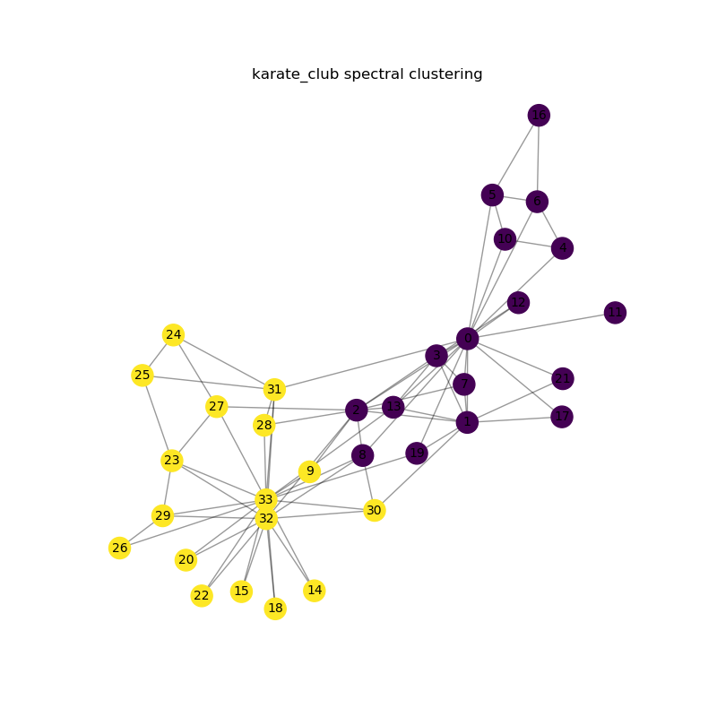

# Learning-Pytorch-Geometric

## Introduction

This repository is mainly a collection of some simple examples of learning PyG, with detailed procedures, from data loading, to model building, to training, forecasting, and visualization. 

And other demo about ML, such as PCA 

**It can be run directly in Google Colab.**

## Main Content

- [x] [Visualization of graph data](Networkx_Draw_Graph/Networkx_Draw_Graph.ipynb)

- [x] [Spectral clustering](Graph_Serctral_Clustering/Graph_Serctral_Clustering.ipynb)

  

- [x] [Graph Convolution for Semi-supervised Clustering of Karate Datasets](GCN_Demo/GCN_Demo.ipynb) From [[Semi-Supervised Classification with Graph Convolutional Networks](https://arxiv.org/abs/1609.02907) (ICLR 2017)]

  

- [x] [SAGE_Conv](SAGE_Conv\SAGE_Conv.ipynb) 

- [x]  [pytorch_geometric_Message_Passing_test](PyG_test\pytorch_geometric_Message_Passing_test.ipynb) 

- [ ] PointNet

  

